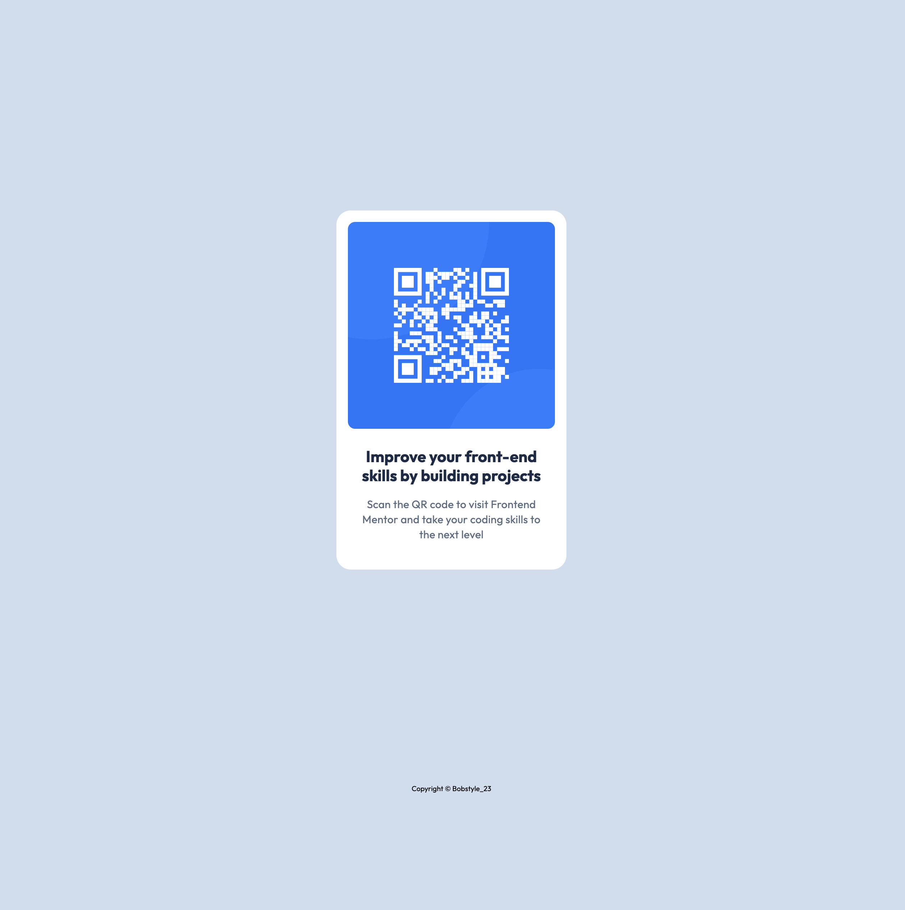

## Table of contents

- [Overview](#overview)
  - [Screenshot](#screenshot)
  - [Links](#links)
- [Author](#author)

## Overview

### Screenshot



### Links

- Solution URL: https://github.com/Bobstyle23/qr-code-component.git

## My process

### Built with

- Semantic HTML5 markup
- CSS
- BEM technique

### What I learned

Regained the part of my basic knowledge of HTML/CSS. Styling using rem units, giving class names with BEM technique.

```html
## Author Frontend Mentor - @Mukhammad Bobur Pakhriev
```
